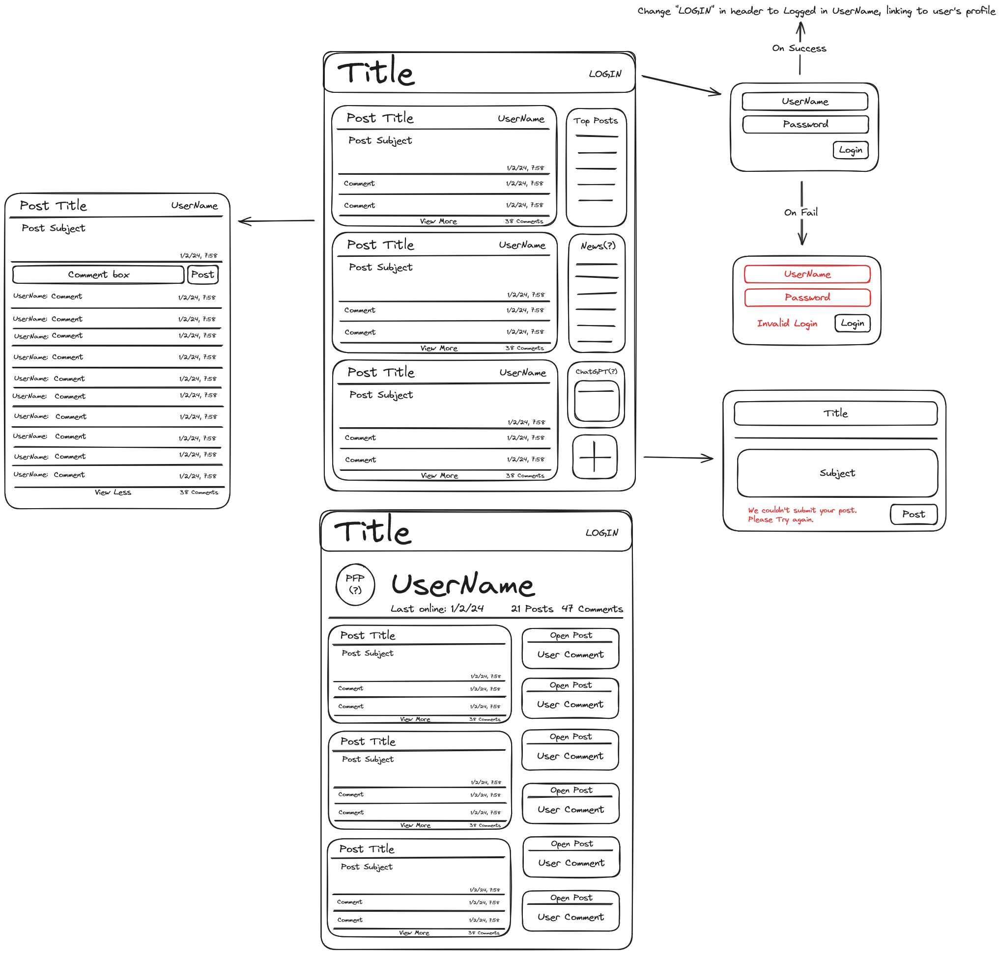

# goneIn60Seconds
UCD Bootcamp Project 2

## Project Description
goneIn60Seconds is a community social media platform with an emphasis on executing searches related to code with room to expand for more topics. 

## User Story
* As A software dev
    * I Want a dedicated coding blog site  
        * So That I can converse and share tips on coding related topics

## Acceptance Criteria
* Given a blog website

    * When I open the website
        > Then I am brought to a main screen with a series of most recent posts
    * When I attempt to log in
        > Then I am presented with a log in page where I am asked for my username and password
    * When I enter incorrect login credentials
        > Then I am provided an error and am unable to log in
    * When I enter correct login credentials
        > Then I am logged into my user profile, and am alerted I have successfully logged in
    * When I am logged in
        > Then I am able to view my profile and make posts/comments
    * When I am logged in and click "new post"
        > Then I am presented with a dialogue asking for a post title, and subject
    * When I am logged in and submit a new post
        > Then that post (title, subject, date/time), is saved and posted onto the main page
    * When I am logged in and click comment on a post
        > Then I am presented with a dialogue asking for my comment
    * When I click on a user/my username
        > Then I am taken to a profile page displaying that user's posts and comments

## Project Reqs:
Must use Node.js and Express.js to create a RESTful API
Must use Handlebars.js as the template engine
Must use MySQL and the Sequelize ORM for the database
Must have both GET and POST routes for retrieving and adding new data
Must use at least one new library, package, or technology that we haven’t discussed
Must have a folder structure that meets the MVC paradigm
Must include authentication (express-session and cookies)
Must protect API keys and sensitive information with environment variables
Must be deployed using Heroku (with data)
Must have a polished UI
Must be responsive
Must be interactive (i.e., accept and respond to user input)
Must meet good-quality coding standards (file structure, best practices, etc.)
Must have a professional README (unique name, description, link to the deployed app)

## Team Members
Rob Gould 
Henry Bell 
Suraj Singh
Matthew Chatman

## Kanban Link
https://github.com/users/rg1202/projects/1

## WireFrame"
